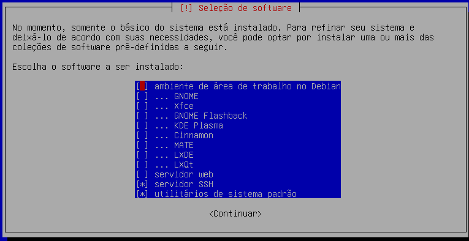
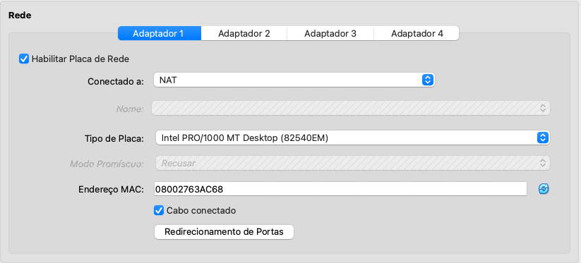
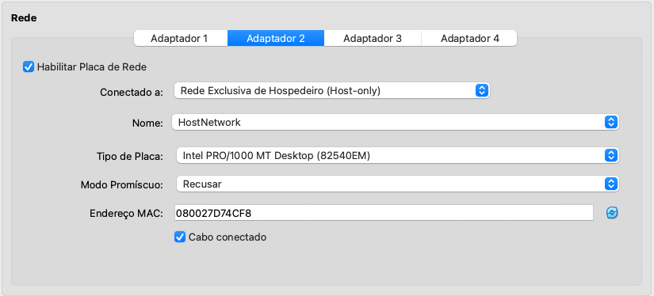

# Configurando sua Máquina Virtual (VM)

Conforme conversado em aula, vamos utilizar a VirtualBox da Oracle, disponível em todos os SOs e pode ser baixado por neste [link](https://www.virtualbox.org/wiki/Downloads). Em seguida, basta seguir o passo a passo do pdf abaixo:

- [Setup do Debian na VM](debian_12-virtualbox.pdf)

## Possíveis problemas

Após realizar a instalação do sistema conforme demonstrado no final do [vídeo](https://youtu.be/s4CM-MZiqWk), você terá acesso a CLI da sua VM: 


### `sudo: comando não encontrado`

Caso a shell não encontre o comando, pode ser que o pacote não veio instalado. Nesse caso verifique se existe um caminho ao pacote com:

```bash
$ which sudo
```

> Para corrigir, basta executar:

```bash
# Entrar como root
$ su
# Instalar o pacote
$ apt install sudo
```

> Agora se executar `sudo` no terminal você verá que foi instalado corretamente.

### `usuario is not in the sudoers file.`

Pode ser que ao logar com o seu usuário e senha você não consiga realizar comandos a nível de administrador por meio do `sudo`. Neste caso, basta:

> Entrar como `root`:

```bash
$ su
```

> Adicione o usuario ao grupo `sudo`:

```bash
$ nano /etc/group

# Encontre essa linha
sudo:x:27:
# Adicione o usuario
sudo:x:27:kaeu
# Salve (Ctrl + O e Enter) e Saia (Ctrl + X)
```

> Faça logout e login novamente para alteração fazer efeito com `exit`. Conferir com `which sudo`.

### Acesso via SSH e Interfaces de Rede

Você vai notar ao longo do tempo que ele não permite realizar a copia (Ctrl+C) ou cola (Ctrl+V) de informações por ali, por exemplo, ou talvez digitar de uma forma mais ágil como você tem o costume na sua máquina local. Esse problema pode ser resolvido de algumas formas, mas aqui, vamos apresentar uma configuração via acesso SSH.

Outro ponto que você pode ter notado é que no boot de configuração houve um momento de instalar outros softwares, como este:



Aqui nós realizamos a instalação somente dos utilitários padrão e o servidor SSH, o que é suficiente pra disciplina e já facilita nossa vida nos próximos passos.

Podemos realizar a conexão da sua máquina (host) à VM de algumas formas:

1. **Modo NAT**: Encaminhamento de Portas pelo VirtualBox
2. **Modo Host-Only**: Criar uma rede privada entre o Host e a VM
3. **Modo Bridge**: Acesso direto ao IP da VM via ponte à rede física do `host`

> Aqui vamos abordar apenas o modo NAT e o Host-Only.

#### Modo NAT | Redirecionamento de portas

Neste caso, o IP não é acessivel pelo Host e necessitamos criar um redirecionamento de portas pelo VirtualBox. Assim, com a VM desligada, vamos realizar a alteração la na aba do Adaptador 1 de Rede, encontrando a seguinte interface:



Vamos selecionar o botão **Redirecionamento de Portas** e criar uma nova regra com os seguintes parâmetros:

- Nome: SSH
- Protocolo: TCP
- IP do Host: vazio ou gateway (127.0.0.1)
- Porta do Host: 2222
- IP do Convidado: vazio
- Porta do Convidado: 22

Em seguida, inicie a VM - pode ser iniciada sem a interface gráfica (via Headless). No seu terminal, acesse via SSH com:

```bash
$ ssh -p 2222 usuario@127.0.0.1
```

> É necessário ter na sua máquina o SSH instalado também. Caso dê tudo certo, você verá um retorno semelhante a este:

```bash
☁  Desenvolvimento [main] ⚡  ssh -p 2222 kaeu@127.0.0.1      
The authenticity of host '[127.0.0.1]:2222 ([127.0.0.1]:2222)' can't be established.
ED25519 key fingerprint is SHA256:zba+qtZ8vIn7k9JrsPogKdTlBnGlsCx0iFqTJOVA2lg.
This key is not known by any other names.
Are you sure you want to continue connecting (yes/no/[fingerprint])? yes
Warning: Permanently added '[127.0.0.1]:2222' (ED25519) to the list of known hosts.
kaeu@127.0.0.1's password: 
Linux controller-mo 6.12.41+deb13-arm64 #1 SMP Debian 6.12.41-1 (2025-08-12) aarch64

The programs included with the Debian GNU/Linux system are free software;
the exact distribution terms for each program are described in the
individual files in /usr/share/doc/*/copyright.

Debian GNU/Linux comes with ABSOLUTELY NO WARRANTY, to the extent
permitted by applicable law.
kaeu@controller-mo:~$ 
```

#### Modo Host-Only | Via DHCP

A nossa segunda opção de acesso é via Adaptador 2 que criamos no inicio do [pdf](debian_12-virtualbox.pdf) chamado `vboxnet0` ou, no meu caso, `HostNetwork`. O que acontece aqui é que a rede criada é privada, permanecendo a comunicação somente entre a sua máquina (host) e a VM.



Ao verificar as interfaces de rede da sua máquina com `ip a`, você verá um retorno semelhante a este, provavelmente com 3 interfaces:

```bash
kaeu@controller-mo:~$ ip a
1: lo: <LOOPBACK,UP,LOWER_UP> mtu 65536 qdisc noqueue state UNKNOWN group default qlen 1000
    link/loopback 00:00:00:00:00:00 brd 00:00:00:00:00:00
    inet 127.0.0.1/8 scope host lo
       valid_lft forever preferred_lft forever
    inet6 ::1/128 scope host noprefixroute 
       valid_lft forever preferred_lft forever
2: enp0s8: <BROADCAST,MULTICAST,UP,LOWER_UP> mtu 1500 qdisc fq_codel state UP group default qlen 1000
    link/ether 08:00:27:63:ac:68 brd ff:ff:ff:ff:ff:ff
    altname enx08002763ac68
    inet 10.0.2.15/24 brd 10.0.2.255 scope global dynamic noprefixroute enp0s8
       valid_lft 86391sec preferred_lft 75591sec
    inet6 fd17:625c:f037:2:c700:6da5:4ca:e44e/64 scope global dynamic mngtmpaddr noprefixroute 
       valid_lft 86387sec preferred_lft 14387sec
    inet6 fe80::cc6b:5e76:4094:e01f/64 scope link 
       valid_lft forever preferred_lft forever
3: enp0s9: <BROADCAST,MULTICAST> mtu 1500 qdisc noop state DOWN group default qlen 1000
    link/ether 08:00:27:d7:4c:f8 brd ff:ff:ff:ff:ff:ff
    altname enx080027d74cf8
```
> Repare que a 3ª interface `enp0s9` está desativada `DOWN`. Esta representa a interface que configuramos pelo Adaptador 2 e atribuimos à nossa rede privada `HostNetwork`. Para ativá-la precisamos entrar na VM e executa os seguintes comandos:
> Pensando na interface dos computadores da FACOM, vale ressaltar que a interface `enp0s8` desse output será equivalente à interface `enp0s3` e a interface `enp0s9` será à interface `enp0s8`. Apenas preste atenção aos nomes, de resto os comandos são os mesmos.

```bash
# Configure a interface para DHCP
$ sudo nano /etc/network/interfaces

# No arquivo, adicione as seguintes linhas:
allow-hotplug enp0s9
iface enp0s9 inet dhcp

# Ative a interface
$ sudo ip link set enp0s9 up

# Solicita um IP automaticamente da rede criada no VirtualBox
$ sudo dhclient enp0s9

# Caso não reconheça o `dhclient`
$ sudo apt install isc-dhcp-client

# Verifique com:
$ ip a
```

> Agora você recolhe o ip da interface `enp0s9` em `inet`, que no meu caso é `192.168.56.2` e realiza o acesso na sua máquina com:

```bash
$ ssh kaeu@192.168.56.2
The authenticity of host '192.168.56.2 (192.168.56.2)' can't be established.
ED25519 key fingerprint is SHA256:zba+qtZ8vIn7k9JrsPogKdTlBnGlsCx0iFqTJOVA2lg.
This host key is known by the following other names/addresses:
    ~/.ssh/known_hosts:7: [127.0.0.1]:2222
Are you sure you want to continue connecting (yes/no/[fingerprint])? yes
Warning: Permanently added '192.168.56.2' (ED25519) to the list of known hosts.
kaeu@192.168.56.2's password: 
Linux controller-mo 6.12.41+deb13-arm64 #1 SMP Debian 6.12.41-1 (2025-08-12) aarch64

The programs included with the Debian GNU/Linux system are free software;
the exact distribution terms for each program are described in the
individual files in /usr/share/doc/*/copyright.

Debian GNU/Linux comes with ABSOLUTELY NO WARRANTY, to the extent
permitted by applicable law.
Last login: Tue Sep  2 17:25:40 2025 from 10.0.2.2
kaeu@controller-mo:~$ 
```

## Links e outras referências

- [README.md](README.md)